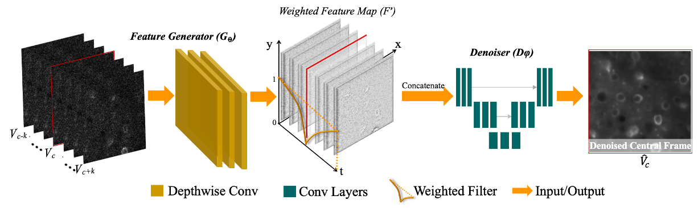
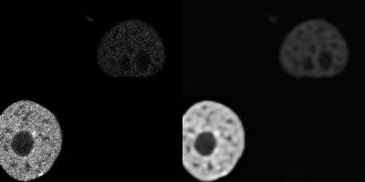
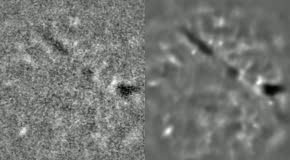
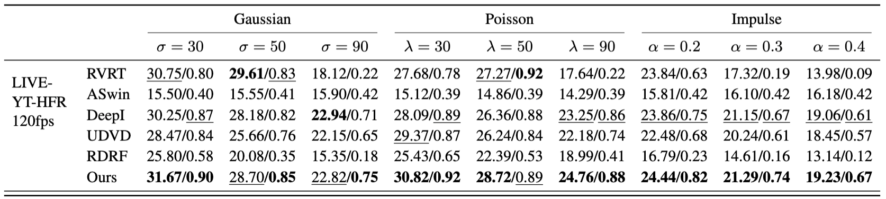

<!-- <h1 style="display: block;">Unsupervised Microscopy Video Denoising</h1> -->
<table style="border: none; display: initial;">
<tr style="border: none;">
<td style="border: none;"><a href="https://maryaiyetigbo.github.io/">Mary Damilola Aiyetigbo</a>1</td>
<td style="border: none;"><a href="korte@clemson.edu">Alexander Korte</a>1</td>
<td style="border: none;"><a href="ema8@clemson.edu">Ethan Anderson</a>1</td>
<td style="border: none;"><a href="chalhoub@musc.edu">Reda Chalhoub</a>2</td>
<td style="border: none;"><a href="kalivasp@musc.edu">Peter Kalivas</a>2</td>
<td style="border: none;"><a href="luofeng@clemson.edu">Feng Luo</a>1</td>
<td style="border: none;"><a href="nianyil@clemson.edu">Nianyi Li</a>1</td>
</tr>
</table>
 
<table style="border: none; display: initial;">
<tr style="border: none;">
<td style="border: none;">1Clemson University</td>
<td style="border: none;">2MUSC</td>
</tr>
</table>

 

<table style="border: none; display: initial;">
<tr style="border: none;">
<td style="border: none;">
<a href="https://www.arxiv.org/abs/2404.12163" style="color: #ffffff">

<i class="bi bi-file-earmark-richtext"></i> Paper

</a>
</td>
<td style="border: none; display: initial;">
<a href="https://github.com/maryaiyetigbo/UMVD" style="color: #ffffff">

<i class="bi bi-github"></i> Code

</a>
</td>
</tr>
</table>

## Two Photon Calcium Imaging
 

# Abstract

In this paper, we introduce a novel unsupervised network to denoise microscopy videos featured by image sequences captured by a fixed location microscopy camera. Specifically, we propose a DeepTemporal Interpolation method, leveraging a temporal signal filter integrated into the bottom CNN layers, to restore microscopy videos corrupted by unknown noise types. Our unsupervised denoising architecture is distinguished by its ability to adapt to multiple noise conditions without the need for pre-existing noise distribution knowledge, addressing a significant challenge in real-world medical applications. Furthermore, we evaluate our denoising framework using both real microscopy recordings and simulated data, validating our outperforming video denoising performance across a broad spectrum of noise scenarios. Extensive experiments demonstrate that our unsupervised model consistently outperforms state-of-the-art supervised and unsupervised video denoising techniques, proving especially effective for microscopy videos.

## Architecture

Our method enhances video denoising by integrating two main components: a feature generator $\mathcal{G}_\phi$ and a Denoiser $\mathcal{D}\theta$. This approach diverges from traditional methods by applying a temporal filter to feature maps generated by CNN layers, before denoising, rather than directly interpolating frames. This process involves selecting a subset of frames from a noisy video, processing these through the feature generator to produce feature maps, and then weighting these feature maps based on their temporal proximity to the central frame using a temporal filter. The temporal filter $\{ \gamma_t\}_{t=1}^N$ weights these feature maps $\{\mathbf{F}_t\}_{t=1}^N$ by assigning diminished values to features nearer the central frame compared to those more distant. The weighted feature maps are then concatenated and processed by the Denoiser to produce the final denoised frame. This technique is particularly effective for videos with high frame rates and slow-moving objects, showcasing a significant improvement in denoising capabilities.

## Results
<!-- Two Photon Calcium Imaging | Fluorescence Microscopy
:-------------------------:|:-------------------------:
 | 

 Two Photon Calcium Imaging           |  Fluorescence Microscopy
:-------------------------:|:-------------------------:
  |   -->

## One Photon Calcium Imaging
 

<table>
 <tr>
  <th align="center"> Two Photon Calcium Imaging </th>
  <th align="center"> Fluorescence Microscopy </th>
 </tr>
 <tr>
  <td align="center">  </td>
  <td align="center">  </td>
 </tr>
</table>

## Results on Natural Videos
<table style="border: none;">
 <tr style="border: none;"><th align="left" style="border: none;"> Bobblehead </th></tr>
 <tr style="border: none;"><td align="left" style="border: none;">  </td></tr>
 <tr style="border: none;"><th align="left" style="border: none;"> Runner </th></tr>
 <tr style="border: none;"><td align="left" style="border: none;">  </td></tr>
</table>

 <!-- Bobblehead           |  Runner
:-------------------------:|:-------------------------:
  |   -->

###

**Performance in Denoising Synthetic Noise.** This table presents a comparison of average PSNR/SSIM values of denoised performance on LIVE-YT-HFR datasets on different noise types and intensities. Our method demonstrates superior performance in most cases and remains highly competitive with the supervised methods.